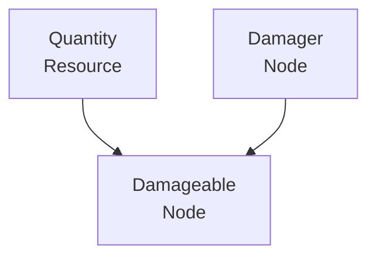
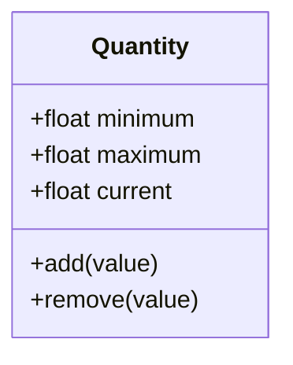
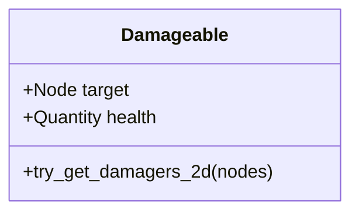
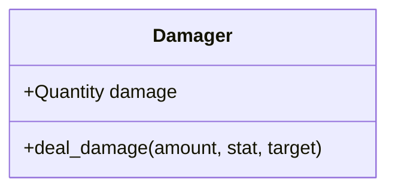
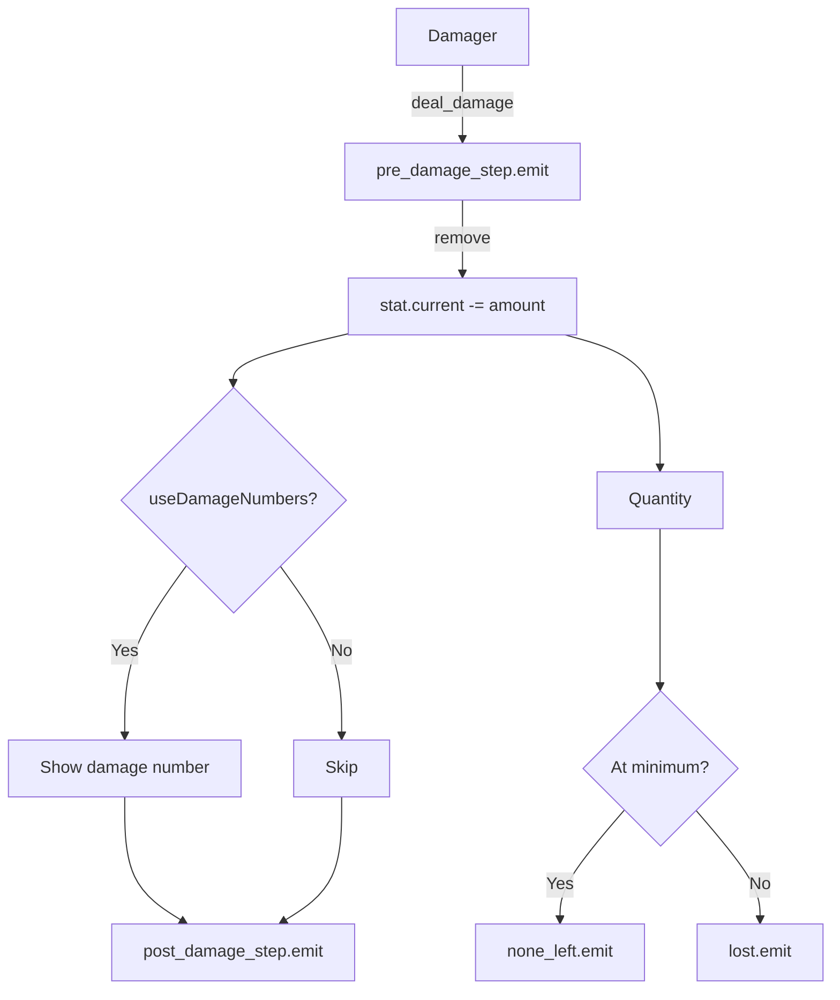
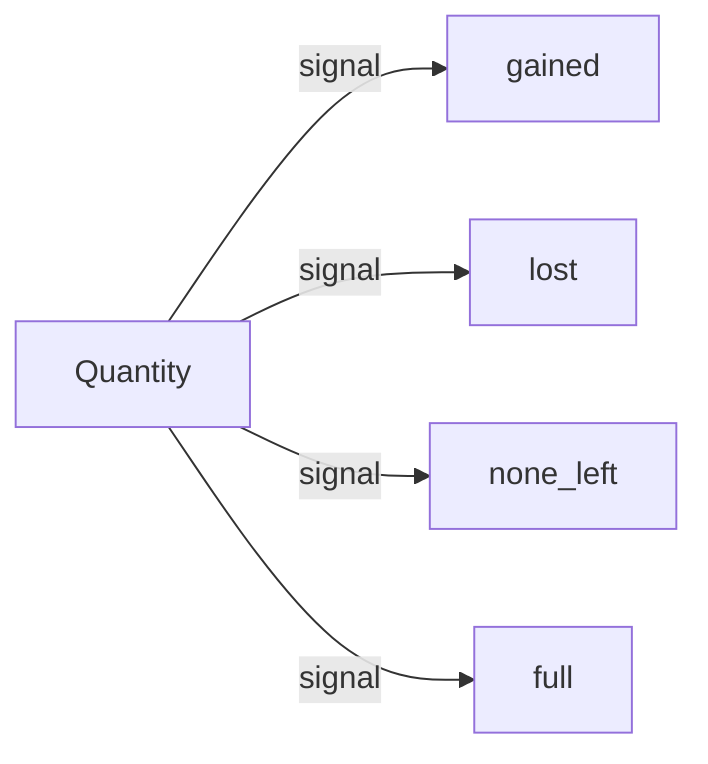
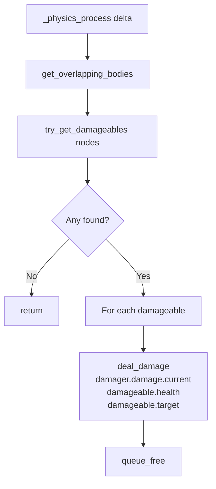
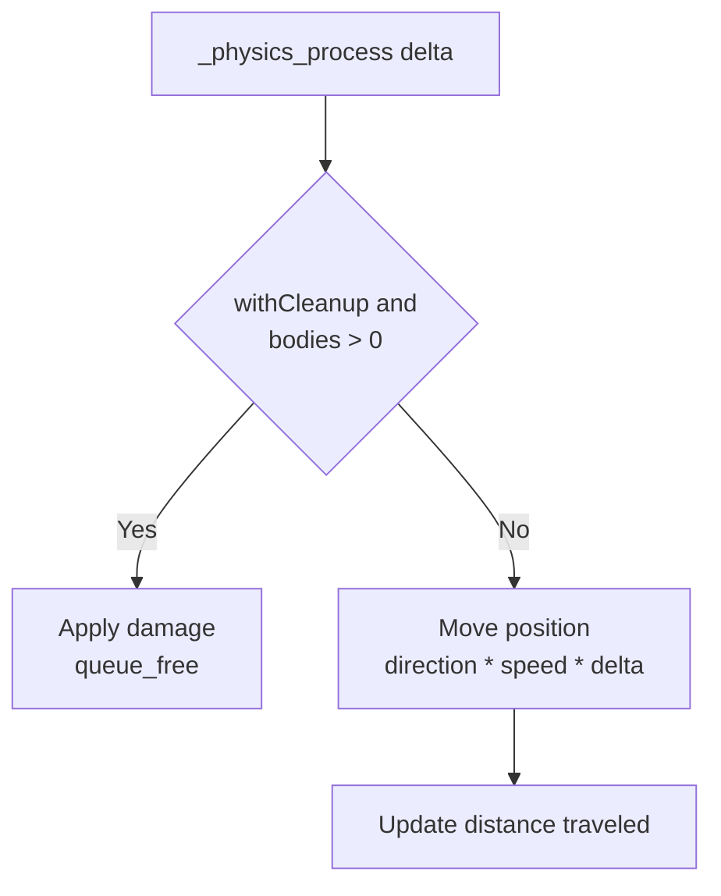
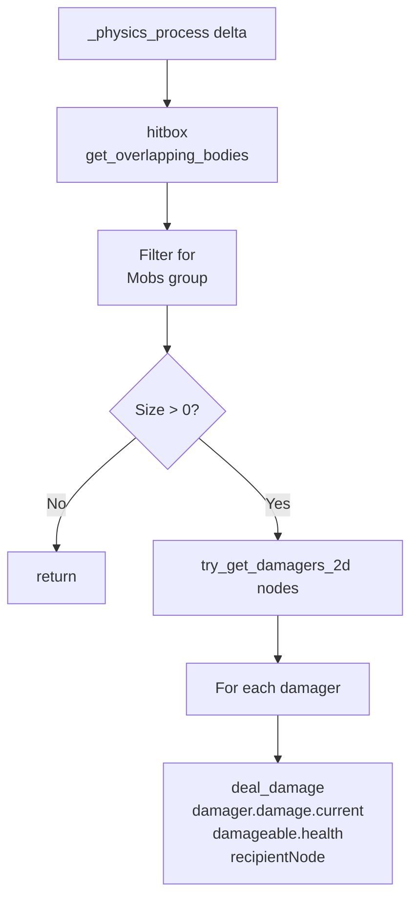

# Damage System Architecture - Diagrams

## Overview

## Quantity

## Damageable

## Damager

## Flow

## Quantity Events

## Damage Mechanics

### DamageOnBodyEntered2D

### LinearForwardMovement2D

### SurvivorLikeProximityDamager

