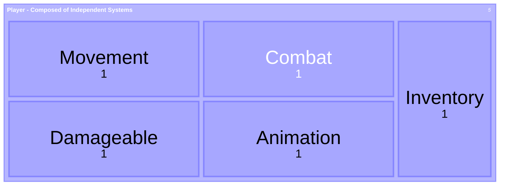
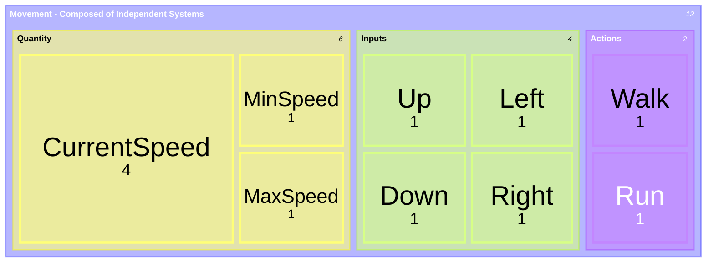

# Godot Game Pet Project

> [!IMPORTANT]
> This README and REPO are works in progress
>
> They may change at any time!

This repo serves as my playground for trying out different ways to orchestrate and design game systems using compositional patterns

Currently my goal isn't to make any one specific kind of game, it's to explore ways to create a framework for composition-driven game development

## Key Principles

- Composition over Inheritance: Systems are independent and composable
- Declarative and Data-Oriented: Resources define data, code defines behavior
- Event-Driven: Signals for state changes
- Fluent APIs: Chainable patterns e.g., node builder

## Documentation

You can check the [Summary](./SUMMARY.md) for information about what's currently setup

More detailed diagrams will get updated in [Diagrams](./DIAGRAMS.md) whenever

## An Example of Composition-Driven Development

At a high-level, it's all about building blocks

This compositional approach aims for declarative-first implementations of mechanics and features

Let's take a Player as an example:

Each system contains the states, stats, functions, and features necessary to operate independently

The lower complexity the system, the more generic

The higher complexity the system, the more specific

Let's say we have a simple Movement System with free movement:

Nothing is inherited, everything is built from foundational types of objects and functions
